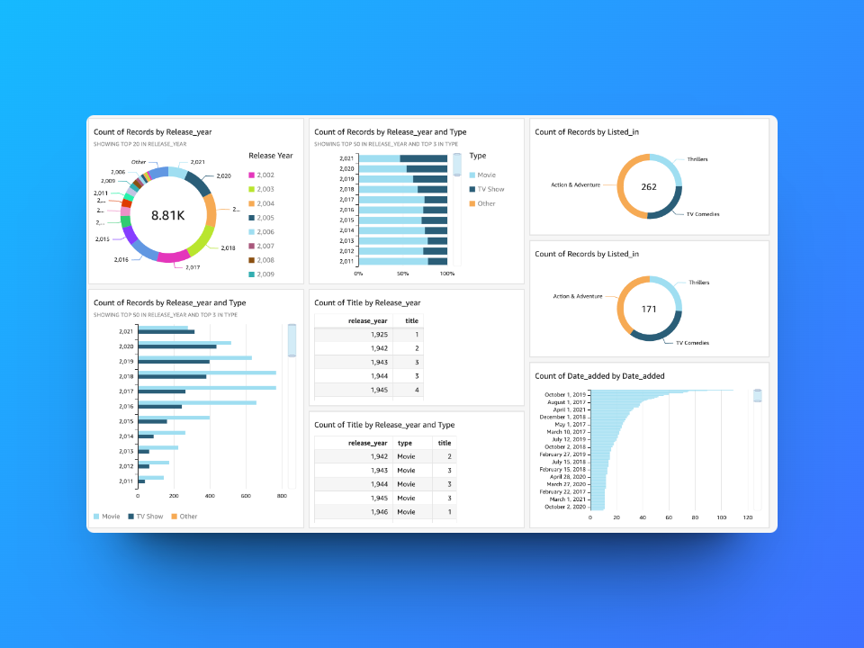

# 📊 Serverless Netflix data dashboard built with AWS Lambda, S3, and Quicksight.

This project uses **Amazon QuickSight** to analyze a **Netflix dataset**, providing interactive dashboards that uncover key insights about movies and TV shows. 🚀  

---

## 🔍 About Amazon QuickSight  
**Amazon QuickSight** is a cloud-powered **business intelligence (BI) tool** that allows users to visualize data, create dashboards, and generate insights using interactive charts and graphs. It integrates with **AWS services** like S3, RDS, and Athena to process large datasets efficiently.  

---

## 🎯 Project Overview  

In this project, we use **Amazon QuickSight** to analyze a large **Netflix dataset** and create an **interactive dashboard** that provides insights into:  

📌 **Movie vs TV Show distribution**  
📌 **Content distribution across years**  
📌 **Top genres and categories**  
📌 **Most popular countries for Netflix content**  
📌 **Content ratings and audience segmentation**  

🚀 **Final Output:** A dynamic **dashboard** that makes Netflix data **visually appealing and easy to understand**!  

---

## 🔧 Tools & Technologies Used  
🔹 **Amazon S3** – To store and import the Netflix dataset  
🔹 **Amazon QuickSight** – For data visualization and dashboard creation  
🔹 **AWS IAM** – To manage access permissions  

---

## 🛠️ Steps to Recreate This Project  

### 1️⃣ Upload Dataset to Amazon S3  
- Download the Netflix dataset (`netflix_titles.csv`)  
- Upload it to an **S3 bucket** in your AWS account  

### 2️⃣ Set Up Amazon QuickSight  
- Create a **QuickSight account**  
- Grant necessary **IAM permissions** for S3 access  

### 3️⃣ Connect QuickSight to S3 Dataset  
- Add **Netflix dataset** as a data source  
- Use **SPICE (Super-fast, Parallel, In-memory Calculation Engine)** for faster analysis  

### 4️⃣ Build Visualizations & Insights  
- Create **bar charts, pie charts, line graphs, heat maps**  
- Add **filters** to explore data dynamically  

---

## 📝 What I Learned  

💡 **Data Visualization Techniques** – How to create **interactive charts & graphs**  
💡 **AWS Integration** – Connecting QuickSight with **S3 datasets**  
💡 **Data Cleaning** – Handling missing values and **formatting datasets**  
💡 **User Experience** – Designing dashboards that provide **meaningful insights**  

---

## 🤔 Why Is This Project Useful?   
✅ **Industry-Relevant** – BI tools like QuickSight are used by **companies worldwide**  
✅ **Data-Driven Decisions** – Helps businesses analyze trends in streaming platforms  
✅ **Cloud-Based** – No need for local installations, everything runs on **AWS**  

---

## 📷 Sample Dashboard Screenshot  

  

---

## 📌 Author  
👤 **Vishnu Vardhan**   

---

